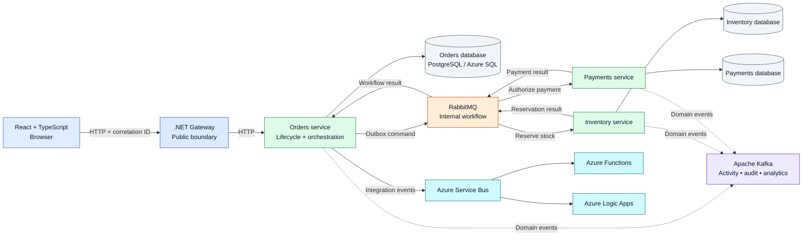

# OrderForge

OrderForge is a learning-focused order-processing system designed to demonstrate how a browser request moves through independently deployable services, databases, and messaging systems.

## End goal

The React client sends an order to the .NET Gateway. The Gateway is the public HTTP boundary and forwards the request to the Orders service. Orders owns the order lifecycle and its data. Inventory and Payments each own their own data and process the order workflow independently. A correlation ID follows the order through HTTP requests, messages, logs, and traces so the entire flow can be observed.

## Architecture

The intended workflow is:

1. Orders stores the order and writes an outbox message in the same database transaction.
2. RabbitMQ carries internal workflow commands between Orders, Inventory, and Payments.
3. Inventory reserves or rejects stock, and Payments authorizes or rejects payment.
4. Orders records the final outcome and publishes integration events through Azure Service Bus.
5. Azure Functions consume those events for asynchronous work such as reconciliation, expiry, and projections.
6. Azure Logic Apps handle external workflows such as customer and operations notifications.
7. Kafka receives domain events for an independent activity stream, audit view, and analytics consumers.

## Technology stack

- React and TypeScript for the browser client
- .NET 10 for the Gateway, Orders, Inventory, Payments, and shared Contracts projects
- PostgreSQL locally, with Azure SQL as the cloud database target; each service owns a separate database
- RabbitMQ for internal application workflow
- Azure Service Bus for the durable Azure integration boundary
- Azure Functions for asynchronous event processing
- Azure Logic Apps for external business workflows and notifications
- Apache Kafka for durable event streaming, audit, and analytics
- Docker Compose for reproducible local infrastructure
- Kubernetes for learning deployments, service discovery, configuration, health probes, and scaling
- Semantic Kernel for a bounded Operations Assistant that can query operational data without replacing deterministic business workflows

The project is intended to showcase practical distributed-systems patterns, including transactional outbox messaging, idempotent consumers, retries, compensation, observability, and independently deployable services.
